# Execution Plan

## Detailed Analysis Summary

### Change Impact Assessment
- **User-facing changes**: Yes - 고객 주문 UI, 관리자 대시보드 전체 신규 구축
- **Structural changes**: Yes - Backend API, Frontend, DB 전체 아키텍처 신규 설계
- **Data model changes**: Yes - 매장, 테이블, 메뉴, 주문, 주문이력 등 전체 스키마 신규
- **API changes**: Yes - REST API 전체 신규 설계 (인증, 메뉴, 주문, 테이블, 매장, SSE)
- **NFR impact**: Yes - SSE 실시간 통신, JWT 인증, 성능 요구사항

### Risk Assessment
- **Risk Level**: Medium
- **Rollback Complexity**: Easy (Greenfield - 기존 시스템 없음)
- **Testing Complexity**: Moderate (SSE 실시간 통신, 다중 매장 시나리오)

## Workflow Visualization

```mermaid
flowchart TD
    Start(["User Request"])
    
    subgraph INCEPTION["🔵 INCEPTION PHASE"]
        WD["Workspace Detection<br/><b>COMPLETED</b>"]
        RA["Requirements Analysis<br/><b>COMPLETED</b>"]
        US["User Stories<br/><b>COMPLETED</b>"]
        WP["Workflow Planning<br/><b>COMPLETED</b>"]
        AD["Application Design<br/><b>EXECUTE</b>"]
        UG["Units Generation<br/><b>EXECUTE</b>"]
    end
    
    subgraph CONSTRUCTION["🟢 CONSTRUCTION PHASE"]
        FD["Functional Design<br/><b>EXECUTE</b>"]
        NFRA["NFR Requirements<br/><b>EXECUTE</b>"]
        NFRD["NFR Design<br/><b>EXECUTE</b>"]
        ID["Infrastructure Design<br/><b>EXECUTE</b>"]
        CG["Code Generation<br/><b>EXECUTE</b>"]
        BT["Build and Test<br/><b>EXECUTE</b>"]
    end
    
    Start --> WD
    WD --> RA
    RA --> US
    US --> WP
    WP --> AD
    AD --> UG
    UG --> FD
    FD --> NFRA
    NFRA --> NFRD
    NFRD --> ID
    ID --> CG
    CG --> BT
    BT --> End(["Complete"])
    
    style WD fill:#4CAF50,stroke:#1B5E20,stroke-width:3px,color:#fff
    style RA fill:#4CAF50,stroke:#1B5E20,stroke-width:3px,color:#fff
    style US fill:#4CAF50,stroke:#1B5E20,stroke-width:3px,color:#fff
    style WP fill:#4CAF50,stroke:#1B5E20,stroke-width:3px,color:#fff
    style AD fill:#FFA726,stroke:#E65100,stroke-width:3px,stroke-dasharray: 5 5,color:#000
    style UG fill:#FFA726,stroke:#E65100,stroke-width:3px,stroke-dasharray: 5 5,color:#000
    style FD fill:#FFA726,stroke:#E65100,stroke-width:3px,stroke-dasharray: 5 5,color:#000
    style NFRA fill:#FFA726,stroke:#E65100,stroke-width:3px,stroke-dasharray: 5 5,color:#000
    style NFRD fill:#FFA726,stroke:#E65100,stroke-width:3px,stroke-dasharray: 5 5,color:#000
    style ID fill:#FFA726,stroke:#E65100,stroke-width:3px,stroke-dasharray: 5 5,color:#000
    style CG fill:#4CAF50,stroke:#1B5E20,stroke-width:3px,color:#fff
    style BT fill:#4CAF50,stroke:#1B5E20,stroke-width:3px,color:#fff
    style INCEPTION fill:#BBDEFB,stroke:#1565C0,stroke-width:3px,color:#000
    style CONSTRUCTION fill:#C8E6C9,stroke:#2E7D32,stroke-width:3px,color:#000
    style Start fill:#CE93D8,stroke:#6A1B9A,stroke-width:3px,color:#000
    style End fill:#CE93D8,stroke:#6A1B9A,stroke-width:3px,color:#000
    linkStyle default stroke:#333,stroke-width:2px
```



### Text Alternative
```
Phase 1: INCEPTION
- Workspace Detection (COMPLETED)
- Requirements Analysis (COMPLETED)
- User Stories (COMPLETED)
- Workflow Planning (COMPLETED)
- Application Design (EXECUTE)
- Units Generation (EXECUTE)

Phase 2: CONSTRUCTION
- Functional Design (EXECUTE, per-unit)
- NFR Requirements (EXECUTE, per-unit)
- NFR Design (EXECUTE, per-unit)
- Infrastructure Design (EXECUTE, per-unit)
- Code Generation (EXECUTE, per-unit)
- Build and Test (EXECUTE)
```

## Phases to Execute

### 🔵 INCEPTION PHASE
- [x] Workspace Detection (COMPLETED)
- [x] Requirements Analysis (COMPLETED)
- [x] User Stories (COMPLETED)
- [x] Workflow Planning (COMPLETED)
- [ ] Application Design - EXECUTE
  - **Rationale**: Greenfield 프로젝트로 전체 컴포넌트 구조, 서비스 레이어, 컴포넌트 간 의존성 설계 필요
- [ ] Units Generation - EXECUTE
  - **Rationale**: Backend API + Frontend(고객/관리자) + DB + Docker 등 다중 모듈 구성으로 단위 분해 필요

### 🟢 CONSTRUCTION PHASE (per-unit)
- [ ] Functional Design - EXECUTE
  - **Rationale**: 주문 라이프사이클, 세션 관리, 매장/테이블 관계 등 복잡한 비즈니스 로직 상세 설계 필요
- [ ] NFR Requirements - EXECUTE
  - **Rationale**: SSE 실시간 통신, JWT 인증, 성능 요구사항 등 NFR 명세 필요
- [ ] NFR Design - EXECUTE
  - **Rationale**: NFR 패턴(SSE 구현, 인증 흐름, 에러 처리) 설계 필요
- [ ] Infrastructure Design - EXECUTE
  - **Rationale**: Docker Compose 구성, MySQL 스키마, 파일 스토리지 설계 필요
- [ ] Code Generation - EXECUTE (ALWAYS)
  - **Rationale**: 구현 필수
- [ ] Build and Test - EXECUTE (ALWAYS)
  - **Rationale**: 빌드 및 테스트 지침 필수

### 🟡 OPERATIONS PHASE
- [ ] Operations - PLACEHOLDER

## Success Criteria
- **Primary Goal**: 테이블오더 MVP 서비스 구축 (고객 주문 + 관리자 운영)
- **Key Deliverables**: Spring Boot API, Next.js Frontend, MySQL Schema, Docker Compose
- **Quality Gates**: 모든 User Story의 Acceptance Criteria 충족
